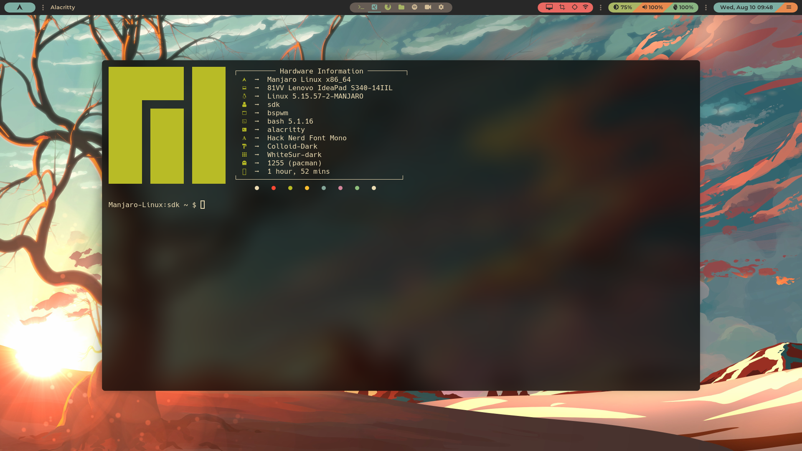
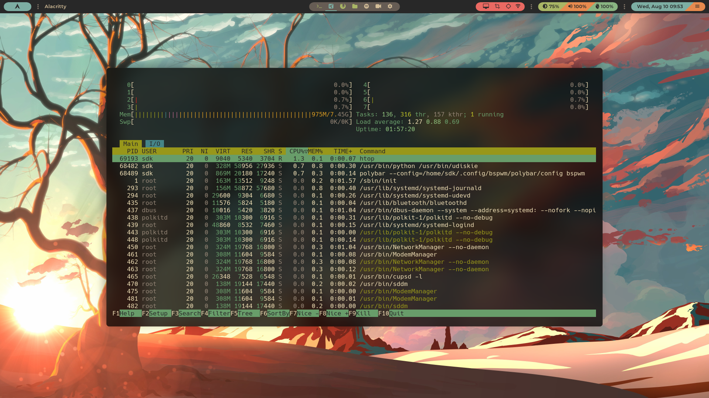
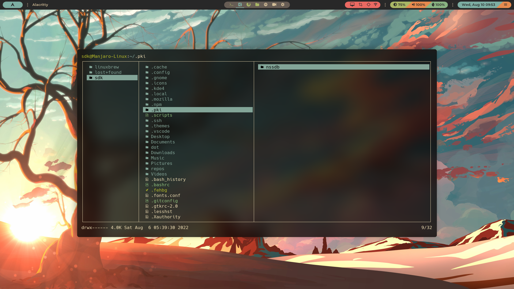

# BSPWM rice

### Installing Dependences

```bash
paru -S bspwm polybar sxhkd ttf-nerd-fonts-hack-complete-git udiskie udisks2 alacritty dunst feh picom-ibhagwan-git xorg-xsetroot xorg-xbacklight xbanish pamixer
```

<br />



<br />


<br />



<br />



<br />


